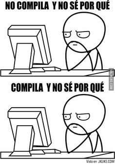

# Trabajo_diapo
Trabajo relacionado las diapositivas muy sencillos de hacer de mis compañeros

## Misión 1
### ¿Que tocaba hacer?
- Hacer lista de mmis tres mejores amigos
- peleamos y agregue otro amigo
- luego supe quienes eran mis amigos

esto fue muy facil y divertido de hacer

## Mision 2
### ¿Que tocaba hacer?
- Preguntarle el nombre a 5 amigos mios
- Su edad 
- su tipo de musica
- Quienee tenian mas de 15
- A quienes les gustaba el rock
## Conclusión
- trabajo muy sencillo para ir trabajando las listas

## Mision 3
### ¿Que tocaba hacer
- Escriba una función que reciba una lista y que devuelva como resultado una tupla almacenando el primero y el ultimo elemento de la lista. En caso de que la lista no tenga dos o mas elementos debe indicarlo y no procesar los datos.

## Lindo

